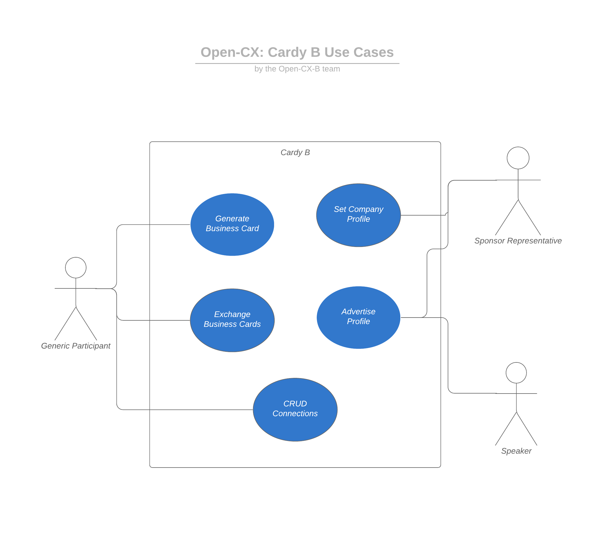
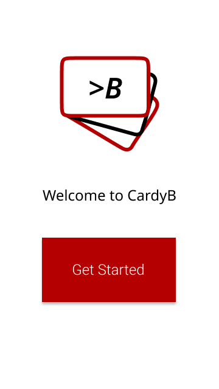
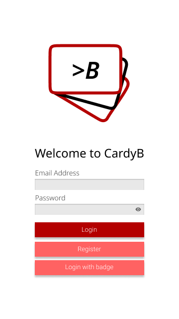
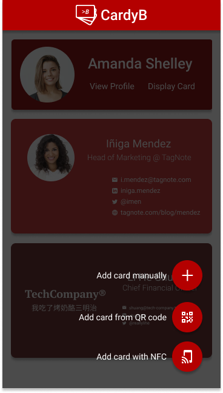
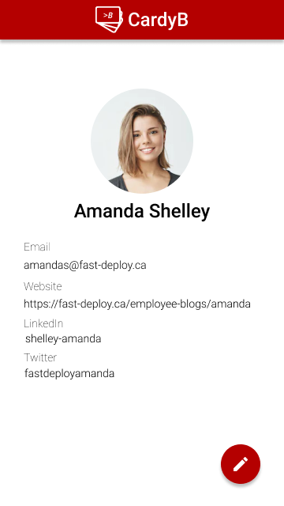
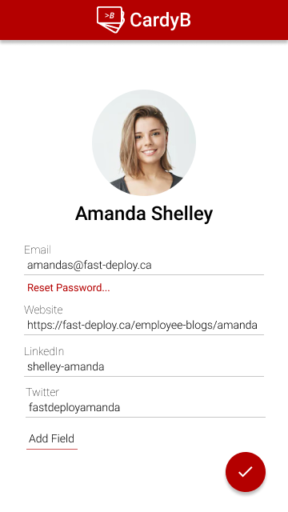
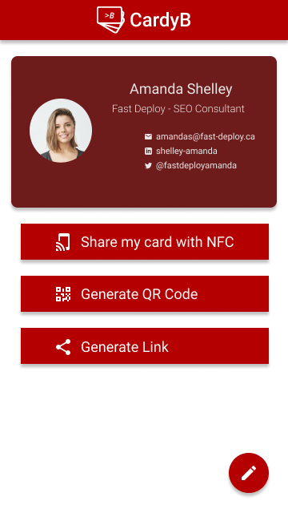
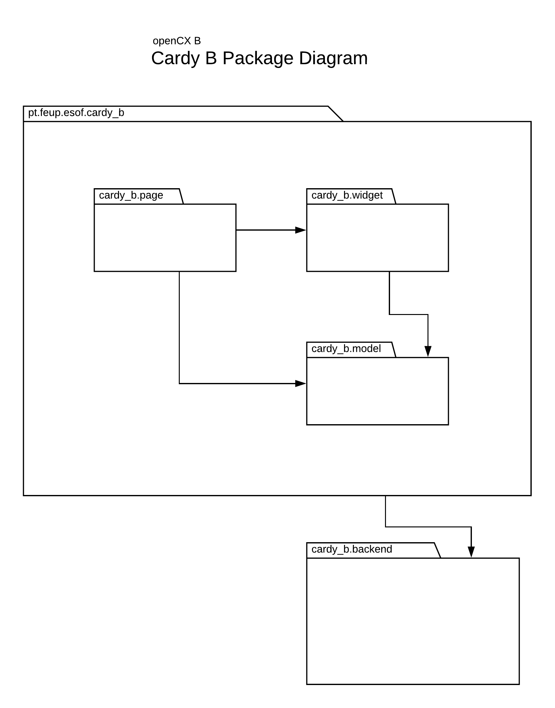

# openCX-*Cardy B* Development Report

Welcome to the documentation pages for *Cardy B* of **openCX**!

You can find here detailed information about the (sub)product, hereby mentioned
as module, from a high-level vision to low-level implementation decisions, a
kind of Software Development Report (see
[template](https://github.com/softeng-feup/open-cx/blob/master/docs/templates/Development-Report.md)),
organized by discipline (as of RUP):

* Business modeling
  * [Product Vision](#product-vision)
  * [Elevator Pitch](#elevator-pitch)
* Requirements
  * [Use Case Diagram](#use-case-diagram)
  * [User stories](#user-stories)
  * [Domain model](#domain-model)
* Architecture and Design
  * [Architectural and design decisions](#architectural-and-design-decisions)
  * [Technological architecture](#technological-architecture)
  * [Logical architecture](#logical-architecture)
* Project management
  * [Tasks management tool](#task-management-tool)

So far, contributions are exclusively made by the initial team, but we hope to
open them to the community, in all areas and topics: requirements, technologies,
development, experimentation, testing, etc.

Please contact us!

Thank you!

*Eduardo Macedo, João Nuno Matos, João Veiga de Macedo, and José Miguel Simões*

## Product Vision
Often, networking at a conference is a messy and arduous affair. The standard of
business card trading has lost its touch with modern realities, being
cumbersome, expensive and unfriendly to the environment. However, they
represented a solution to the circumstances at hand. They are:

 * Easy to exchange and store
 * Compact and straight to the point
 * A medium to showcase appealing design

What if you could bridge these advantages and modern technologies to have your
cake and eat it too? *Cardy B* aims to do just that.

It is an innovative digital networking system, using the latest in interactive
technologies to provide seamless, paperless networking to the participants of
your conference. With this system in place, your users can:

 * Create their virtual business card, integrated with their social media, CVs,
   or portfolios
 * Have a wallet to store their connections right on their phones/conference
   app/website
 * Exchange information in an intuitive, seamless and convenient way
 * Interacting with smart badges and sponsor stands, making use of the latest in
   NFC and QR technologies
 * Look cool while doing all of it

We understand that sometimes there is an option between interaction and
convenience, but with *Cardy B* you can get them both, you don't need to choose.

No plan B needed.

## Elevator Pitch
Have you recently been to a conference? How many business cards did you collect?

If I had to hazard a guess, it was a pain in the ass to  store them all, and to
follow up on them.

Our new system, Cardy B, is going to solve just that. Just pull out your
smartphone and scan their badge, and you'll get their cards just like that.

\*snap fingers\*

You can customize your card, and share it via NFC or QR code, easy easy. Be
smart, be creative, be sustainable, use Cardy B.

## Requirements

In this section we aim to describe the problem domain our system aims to tackle,
and discuss the requirements of our solution.

### Use case diagram

#### Attendees
Cardy B's use cases for a conference attendee is to easily make and manage their
connections with other participants of the conference. To that end, they would
have utility for:
  * Facilities to set their profile
  * Design and styling tools for their virtual business card
  * Easy ways to make connections with other participants
  * Ability to perform CRUD operations on their connections

#### Speakers
Cardy B's use cases for a speaker, in addition to those of a normal attendee,
includes the following:
  * Ability to publicise their profile, e.g. as a card, in their presentations

#### Sponsor Representative
As a representative of a sponsor, in addition to all of the above, also needs:
* To set the company's profile, and have a separate card for it.
* To integrate their connections wallet with the sponsor's infrastructure.
* To have a way to collect connections unattended (e.g. for a sponsor stand)

### User stories

This section contains the requirements for the product, described as **user**
**stories**, organized in a global **user story map** with **user roles** or
**themes**. They will be added as the project is developed.

#### Complete

  * 'As a conference attendee, I want to be able to keep track of the people I
    interacted with, so that I can reach out to them in the near future more
    easily.'

#### Good

  * 'As a conference attendee, I want to be able to put up all my important
    information (e.g. LinkedIn, CV link, GitHub) in my profile, so that other
    attendees can learn more about me.'
  * 'As a conference attendee, I want to quickly assemble a clean business card
    so that I don't waste any time in preparations.'

#### In Progress

  * 'As a user, I want to be able to add a user to my connections by scanning a
    QR code, so that I do not waste time searching for them.'
  * 'As a user, I want to generate a QR code so that I can easily and quickly
    share my information with other participants.'

### Domain model

### Frontend Mockups
#### Onboarding / Login
##### Onboarding - Screen 0

##### Onboarding - Screen 1

##### Login Screen

#### Wallet / Connection Management
##### Wallet Screen

##### Connection Adding

#### Profile Management
##### Own Profile View

##### Own Profile Edit

#### Card Management
##### Own Card View

##### Own Card Edit

# Architecture and Design
## Architectural and Design Decisions
Following the general trend of the whole openCX project, we decided to provide a
basic backend architecture and build upon it in our front end. To that end, we
planned to have a Cardy B backend, a Cardy B app and, if time permitted, an
embedded Cardy B client for NFC enabled devices (e.g. Raspberry Pi with add-on
sensor). Generally, we aimed to produce relatively independent UI components, so
that we could reuse them in the openCX frontend app.

## Technological Architecture
We decided to use MongoDB/Express/Node.js for our backend. It would provide us
with just the necessary components to perform CRUD operations on a REST API.

We decided to use Flutter for our frontend. It is a modern framework that
provides us with a streamlined way of building a cross-platform mobile app.

## Logical Architecture
We can subdivide our solution in the following logical components:

# Project Management
## Task Management Tool

We used a Trello board as our task management tool. You can have a look at it at
the following URL:

https://trello.com/invite/b/9uMMeBil/f76ed72cb31577e2a3b75704a27ae99e/esof-cardy-%F0%9F%85%B1%EF%B8%8F
